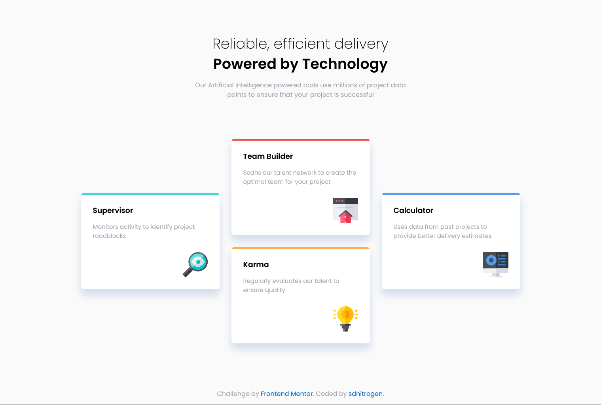

# Frontend Mentor - Four card feature section solution

This is a solution to the [Four card feature section challenge on Frontend Mentor](https://www.frontendmentor.io/challenges/four-card-feature-section-weK1eFYK).

## Table of contents

-   [Overview](#overview)
    -   [The challenge](#the-challenge)
    -   [Screenshot](#screenshot)
    -   [Links](#links)
-   [My process](#my-process)
    -   [Built with](#built-with)
    -   [What I learned](#what-i-learned)
    -   [Continued development](#continued-development)
    -   [Useful resources](#useful-resources)
-   [Author](#author)
-   [Acknowledgments](#acknowledgments)

## Overview

### The challenge

To build out the feature section of a brand website and get it looking as close to the design as possible.
Users should be able to:
-   View the optimal layout for the site depending on their device's screen size

### Screenshot



### Links

-   Solution URL: [https://t.co/qTizC85YsB](https://t.co/qTizC85YsB)
-   Live Site URL: [https://four-card-feature-section-sdnitrogen.vercel.app/](https://four-card-feature-section-sdnitrogen.vercel.app/)

## My process

### Built with

-   Semantic HTML5 markup
-   CSS custom properties
-   Flexbox
-   Mobile-first workflow

### What I learned

Used CSS Flexbox for both the container of the cards and the content of the cards. At first, for the top borders on the cards, I used border-top, but quickly realized that using border-radius on top of that would curve the colors as well which was not expected in the challenge, so I used this neat little trick to create a line on top of the cards:

```css
.card::after {
    content: "";
    position: absolute;
    top: 0;
    left: 0;
    width: 100%;
    height: 5px;
}
```

### Continued development

I'd continue to polish my css flexbox skills and grids as well for designing the perfect layouts.

### Useful resources

-   [CSS Tricks](https://css-tricks.com/) - This website always comes in clutch when you need to lookup specific css functionalities.

## Author

-   Website - [sdnitrogen](https://sdnitrogen.github.io)
-   Frontend Mentor - [@sdnitrogen](https://www.frontendmentor.io/profile/sdnitrogen)
-   Hashnode - [Nitro Blog](https://sdnitrogen.hashnode.dev/)

## Acknowledgments

I've included a CSS Flexbox cheat-sheet that I always refer to when I'm stuck and I'd love to mention the original creator here - [@simonpaix](https://twitter.com/simonpaix).
